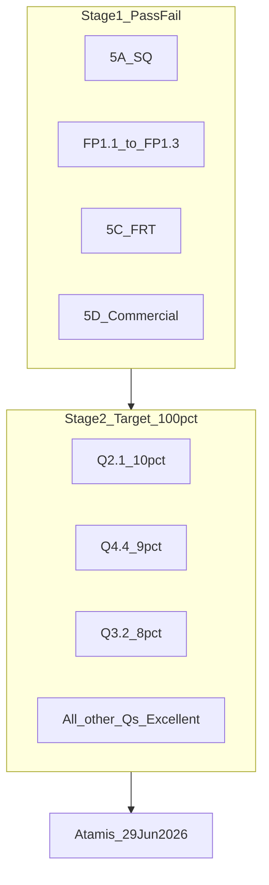

# Sudbury Surgery Bid — 100% Scoring Plan

**Procurement:** Atamis C444743 | **Lot:** 4 Sudbury Surgery | **Bidder:** High Med Ltd + Dr Singh Hammond Road  
**Deadline:** 29 June 2026, 12:00 | **Service start:** 1 November 2026  
**Target:** Excellent (10/10) on all 20 weighted questions → **100% quality score**

---

## Success definition

| Rule | Implication |
|------|-------------|
| Stage 2 quality = **100%** of scored evaluation ([Document 1](Sudbury%20surgery%20/Document%201%20-%20Instructions%20and%20Guidance.docx) §19.1) | Commercial (5D/5C) is pass/fail only — **all competitive advantage is quality** |
| **Excellent (10)** = in-depth detail, robust evidence, lessons learnt, demonstrable added value ([5B v2](Sudbury%20surgery%20/Document%205%20B%20-%20Quality%20and%20Technical%20Questions%20-%20Lot%204%20Sudbury%20Surgery%20v2.docx)) | Target **10/10 on every weighted question** |
| Minimum **Limited (2)** per question; **0 = elimination** | Red-team must verify every bullet in every question is answered |
| **No cross-referencing** between questions (5B v2) | Duplicate evidence inline; Sudbury-branded attachments only |

**Scoring maths:** All Good (8) = 80%. Isleworth winner scored 81% with incumbent operational data. This plan targets **100%**, not 80–85%.



---

## Critical fixes (from Isleworth pressure test)

### 1. Split mobilisation into two deliverables

| Question | Weight | Content | Attachments |
|----------|--------|---------|-------------|
| **FP1.3** | Pass/Fail | TUPE, PID/GDPR/DPA 2018, pensions, stakeholder engagement, financial impact, BCP during transfer | 2pp **TUPE Mobilisation Plan** (outside 2000w) |
| **Q2.7** | 4% | **Access & patient choice mobilisation** — appointment policy, choice of clinician, wait-time baselines, Extended Hours MOU, monitoring/feedback | Gantt/timeline + risk assessment (outside 1500w) |

Do **not** put PID migration in Q2.7. Isleworth scored Limited on mobilisation for PID/GDPR gaps — that learning goes into **FP1.3**, while Q2.7 answers Sudbury access bullets only.

### 2. Q5.3 is not Isleworth’s “NHS fit for future”

Sudbury **Q5.3 (4%)** = **Break down barriers to opportunity**: inclusive recruitment, bias mitigation, embedding inclusion in delivery, **monitored KPIs**. Lead with Brent’s 64% BAME population mirror, anonymised shortlisting, apprenticeships, London Living Wage — not Freedom to Speak Up as the centrepiece.

### 3. Q2.8 vs Q2.9 labelling

- **Q2.8** = Premises (4%)
- **Q2.9** = Patients 75+ (3%, **2000 words**, 12 mandatory bullets)

---

## Named leadership team (refine before Q2.1)

Derived from [Isleworth 5B v4](Previous%20bid%20for%20Isleworth/Document%205%20B%20-%20Quality%20and%20Technical%20Questions%20-%20High%20Med%20Consortium%20v4.docx):

| Role | Proposed name | Organisation | Sudbury narrative |
|------|---------------|--------------|-------------------|
| Clinical Director / contract accountable officer | **Dr Shumaila Mahmood** | High Med Ltd | Overall governance, board assurance |
| Local clinical lead / LTC & frailty | **Dr Gursharan Singh** | Dr Singh Hammond Road (key party) | Chronic disease, frailty MDT, clinical governance |
| Mobilisation lead | **Dr Usama Safeer** | High Med Ltd | FP1.3 + Q2.7 coordination |
| Practice Manager | **Ms Manjot Kaur** | High Med Ltd | Operational delivery, retention, staff engagement |
| Deputy PM / operational compliance | **Retaining TUPE DPM** + **Ms Manjot Kaur** oversight | TUPE + High Med | PM on disciplinary: interim governance via DPM + CD |
| Safeguarding lead GP | **Dr Gursharan Singh** | Consortium | Children/adults, MASH escalation |
| Board safeguarding assurance | **Dr Shumaila Mahmood** | High Med Ltd | Corporate governance |
| Caldicott / IG lead | **Dr Muhammad Adem** | High Med Ltd | DSPT, London Care Record, data migration |
| Prescribing / medicines optimisation | **Dr Gursharan Singh** | Consortium | Brent formulary, SMR, TCAM/DMS |
| Public health / immunisation | **Dr Saira Safeer** | High Med Ltd | Q2.6 vaccines, outreach |
| IPC lead | **Ms Gladys Amaf** | High Med Ltd | Infection prevention, premises |
| PHM / data dashboard owner | **Dr Muhammad Adem** | High Med Ltd | Q4.4, WSIC/pop-health dashboards |
| PCN interface lead | **Dr Gursharan Singh** | Consortium | Brent Central K&W PCN DES, Access Hub |

**Confirm before writing:** TUPE PM/DPM names; Brent-resident GP face; PCN pharmacist model; frailty home-visit clinician (GP vs ANP/paramedic).

---

## Public evidence bank (research now)

### Practice profile
- **ODS E84685** — Sudbury Primary Care Centre, Vale Farm, Watford Road, Wembley HA0 3HG
- **List size:** 7,788 (ITT/MOI Apr 2026); practice board 7,949 (late 2024)
- **CQC:** Good (July 2023 reaffirmation)
- **Provider:** NHSolutions (APMS ends ~Oct 2026)
- **Hours:** Mon–Fri 08:00–18:30; Sat 09:00–13:00 | **Open list**

### PCN & system integration
- **PCN:** Brent Central K&W PCN — Tudor House, Sudbury, Preston Road, Ellis, Chalkhill
- **Federation:** K&W Healthcare — 27 practices, 220k+ patients
- **Brent ICP:** access, digital/telephony, housebound nursing, inequalities

### Brent / Wembley population
- 4th most deprived London borough; ~64% BAME; ~1 in 3 main language not English
- Diabetes prevalence 8.58% vs England 7.26%
- 65+ growth +58% by 2041; 75+ +71%
- **No One Left Behind** + Brent PCN SMART action plans on access inequalities
- **Brent Health Matters:** outreach, health checks, GP registration

### Patient experience baselines
- GPPS 2025: 110/493 responses (22%); many breakdowns limited on portal
- HealthSay proxy: 64% good experience vs 74% national; 19/24 in Brent West
- National: 53% find phone contact easy (CQC State of Care 2024/25)

### Access KPI maths (7,788 list)
- ≥72 GP/NP + ≥25 nurse/HCA consultations per 1,000 Carr-Hill weighted patients/week
- ≥100 total consultations per 1,000/week
- NHS 111 bookable slots: ≥3/week (1 per 3,000 patients)
- Single-contact booking

### TUPE workforce
- **14 transferring** + **3 vacancies** (2 GP + 1 PN)
- PM on disciplinary; majority NHS Pension; non-AFC T&Cs

---

## Data still required (do not fabricate)

Chase via MOI, NHSolutions handover, and [clarification log](Sudbury%20surgery%20/Clarification%20logs/Lot%204%20Sudbury%20Surgery%20-%20Clarification%20Log%20v1.0.xlsx):

| Category | Required for | Source |
|----------|--------------|--------|
| Carr-Hill weighted list size | Access KPI maths | CQ47 |
| Clinical system (EMIS/SystmOne) | FP1.3, Q2.1, Q2.5 | MOI / NHSolutions |
| QOF achievement % and £ | Q2.1, Q4.4 | CQ51 |
| Wait times, same-day urgent %, DNA | Q2.7 | NHSolutions |
| Face-to-face vs remote split | Q2.7, Q4.1 | NHSolutions / GPPS |
| Immunisation uptake by cohort | Q2.6 | MOI |
| ED/UTC attendance | Q4.4 | CQ39 |
| Clinical workflow backlogs | Q2.5, FP1.3 | CQ37 |
| ARRS roles/WTE | Q3.2 | MOI / CQ50 |
| LES/DES revenue | 5D, Q2.1 | CQ10, CQ52 |
| Estates costs, NIA, room count | Q2.8, 5D | CQ9, CQ42, CQ44, CQ48 |
| Locum costs 2025/26 | 5D | CQ53 |
| Patient engagement outputs | Q4.2, Q4.1a | ICB paper 3.3b |
| NWL dashboards | Q4.4, Q2.9 | CQ8 |

**Interim strategy:** Use Brent epidemiology + contractual KPIs as go-live targets; Day-1 audit commitment for Q2.7 if NHSolutions data unavailable pre-award. Do **not** invent wait times.

---

## Excellent (10) playbook — every question

1. **Local context** — Sudbury/Brent/Wembley data (2–3 sentences)
2. **Contractual tie-in** — Service Specification clause
3. **How / Who / When** — Named role; weekly/monthly rhythm; 18-month phasing
4. **Inline evidence** — TUPE, CQC Good, track record (no cross-refs)
5. **KPI table** — Baseline → 6mo → 12mo → 18mo
6. **Added value** — One measurable differentiator beyond spec

---

## Question-by-question strategy

### Prerequisites & commercial (Week 1 — parallel)

| Item | Approach |
|------|----------|
| **FP1.3** | Aug–Nov timeline; PID/GDPR/DPA 2018; ICO; Lloyd George digitisation; ICB contacts; RAG risks; locum plan for 3 vacancies; PM disciplinary governance; TUPE costs in 5D |
| **5D / 5C** | Resolve estates/global sum clarifications; bid within affordability |
| **5A / 5F** | Both consortium parties |

### Criterion 2 — Quality (51%)

| Q | Wt | Focus |
|---|-----|-------|
| **Q2.1** | 10% | Named org chart; 4×2pp PDFs; access KPI maths; Brent inequalities; primary dashboard |
| Q2.2 | 8% | LFPSE; named safety roles; audit calendar |
| Q2.3 | 6% | Isleworth Good + Brent formulary; SMR; blocked-repeat comms |
| Q2.4 | 6% | Policies; MCA/LPS 16–17; quarterly audits |
| Q2.5 | 5% | Sudbury system plan; 111 slots; telephony KPIs |
| **Q2.6** | 5% | Fresh — cold chain, UKHSA, Brent outreach |
| **Q2.7** | 4% | Access/choice only; Extended Hours MOU; Gantt + risk |
| Q2.8 | 4% | Sudbury PCC; CHP; multilingual/dementia-friendly |
| **Q2.9** | 3% | 12 bullets; home visit response times; eFI; MDT |

### Criterion 3 — Integration (14%)

| Q | Wt | Focus |
|---|-----|-------|
| Q3.1 | 6% | Brent PCN DES; LES; Wembley neighbourhood; zero Hounslow |
| Q3.2 | 8% | 17 TUPE positions; ARRS via PCN; retention PDF; KPIs |

### Criterion 4 — Access & PHM (25%)

| Q | Wt | Focus |
|---|-----|-------|
| Q4.1 | 4% | IMD/ethnicity; DNA by cohort; deprivation metrics |
| Q4.1a | 2% | 2×2pp case studies (BAME diabetes; digital exclusion) |
| Q4.2 | 4% | PPG; You Said We Did; ICB paper 3.3b |
| Q4.3 | 4% | Isleworth Good framework; Sudbury co-design |
| **Q4.4** | 9% | Core20PLUS5; Brent drivers; workforce capacity; 2pp PHM PDF |
| Q4.4a | 2% | Hypothetical Wembley diabetes programme |

### Criterion 5 — Social Value (10%)

| Q | Wt | Focus |
|---|-----|-------|
| Q5.1 | 3% | NHS Net Zero; measurable carbon/waste targets |
| Q5.2 | 3% | Brent community safety; de-escalation; outreach |
| **Q5.3** | 4% | Inclusive recruitment; anonymised shortlisting; diversity KPIs |

---

## Planned folder structure (when executing)

```
Sudbury Bid - High Med Consortium/
├── 00 - Working/
│   ├── Local-Data-Research-Brief.md
│   ├── Named-Roles-Register.md
│   ├── Excellent-10-Checklist.md
│   ├── Feedback-Remediation-Matrix.xlsx
│   └── Word-Count-Tracker.xlsx
├── 01 - Tender Response Documents/   (5A, 5B v2, 5C, 5D, 5F)
├── 02 - Attachments/                 (PDF, max 2pp A4 each)
├── 03 - Supporting Evidence/
└── 04 - Submission Checklist/
```

**Sources:** [5B v2](Sudbury%20surgery%20/Document%205%20B%20-%20Quality%20and%20Technical%20Questions%20-%20Lot%204%20Sudbury%20Surgery%20v2.docx), [Isleworth bid](Previous%20bid%20for%20Isleworth/), [TUPE data](TUPE/Document%204%20-%20TUPE%20Information%20for%20Lot%204%20Sudbury%20Surgery%20-%20UNREDACTED.xlsx)

---

## Execution timeline

| Week | Dates (approx) | Deliverables |
|------|----------------|--------------|
| **W1** | Now – 13 Jun | Setup; evidence brief; FP1.3 + TUPE PDF; 5D/5C draft; chase MOI |
| **W2** | 14–20 Jun | Q2.1 + 4 attachments; Q4.4 + Q4.4a; Q3.2 + workforce PDFs |
| **W3** | 21–27 Jun | Q2.2–2.6, Q2.7–2.9, Q3.1, Q4.1–4.3, Q4.1a |
| **W4** | 28–29 Jun | Q5.1–5.3; 5A/5F; red-team; Atamis upload |

**CQ deadline:** 2 June 2026

---

## Red-team checklist (pre-submission)

- [ ] Every question meets **Excellent** definition
- [ ] **FP1.3** = TUPE/PID; **Q2.7** = access/choice only
- [ ] No cross-references between questions
- [ ] All **17 TUPE positions** accounted for
- [ ] **3 vacancies** — recruitment + locum contingency
- [ ] **PM disciplinary** mitigation documented
- [ ] Access KPI maths for **7,788** list
- [ ] **Q5.3** = barriers to opportunity
- [ ] Word counts per **5B v2** (Q2.9 = 2000w)
- [ ] Attachments ≤2pp A4 PDF
- [ ] Commercial within affordability threshold
- [ ] No question scores **0**

---

## Workstreams (planning phases)

1. **Evidence & research** — Local data brief; named roles; remediation matrix; MOI gap chase
2. **TUPE & mobilisation** — FP1.3 narrative + 2pp attachment
3. **Commercial** — 5D/5C within affordability (Week 1, not Week 4)
4. **High-weight quality** — Q2.1, Q4.4, Q3.2 + attachments
5. **Remaining quality** — All other 5B questions + case studies
6. **Red team & submission** — Excellent checklist; word counts; Atamis upload
